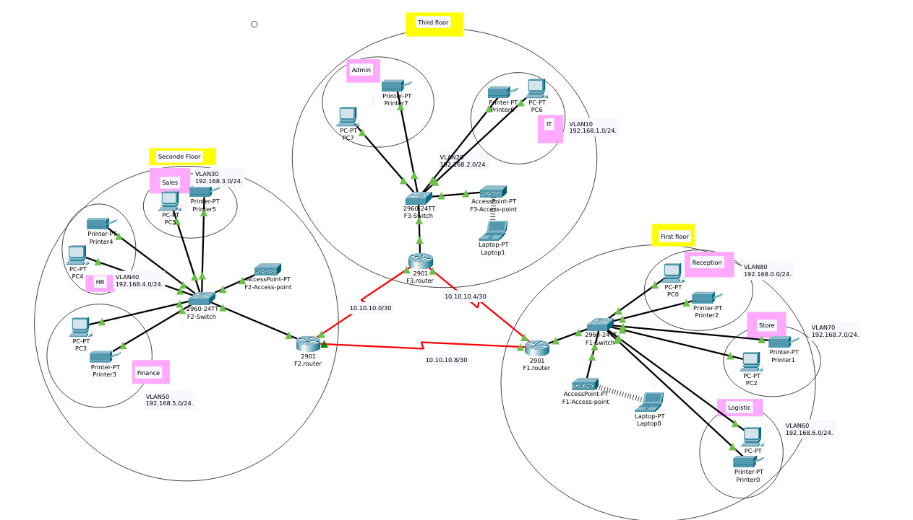

# Vic Modern Hotel Network Design

## Table of Contents
- [Overview](#overview)
- [Network Topology](#network-topology)
- [IP Addressing Scheme](#ip-addressing-scheme)
- [VLAN Configuration](#vlan-configuration)
- [Routing Protocol (OSPF)](#routing-protocol-ospf)
- [Other Key Configurations](#other-key-configurations)
  - [DHCP Server](#dhcp-server)
  - [SSH Remote Access](#ssh-remote-access)
  - [Port Security](#port-security)

---

## Overview

This project simulates a three-floor hotel network using Cisco Packet Tracer. Each floor operates as a distinct network segment, managed by its own router, switch, and wireless access point. The design focuses on robust inter-floor communication, efficient IP address management, and secure remote access.

## Network Topology

The network consists of three main segments, one for each floor of the hotel:

* **Three Floors:** The hotel is divided into three distinct network zones (First, Second, and Third Floor).
* **Routers:** Three Cisco 2911 routers (`F1.router`, `F2.router`, `F3.router`) are deployed, with one assigned per floor.
    * **Interconnections:** Routers are interconnected via serial DCE cables. To enable serial connections, `WIC-2T` serial interface modules are added to each router.
* **Switches:** Each floor features a Cisco 2960-24TT switch (`F1-Switch`, `F2-Switch`, `F3-Switch`) to manage local device connections and VLANs.
* **Access Points:** A wireless access point (`F1-Access-point`, `F2-Access-point`, `F3-Access-point`) is present on each floor to provide Wi-Fi.
* **End Devices:**
    * **First Floor:** PCs and printers for Reception, Store, and Logistics departments.
    * **Second Floor:** PCs and printers for Finance, HR, and Sales & Marketing departments.
    * **Third Floor:** PCs and printers for IT and Admin departments.
    * **Wireless Devices:** Laptops, tablets, and smartphones connect via Wi-Fi across all floors.

## IP Addressing Scheme

IP addresses are assigned dynamically using DHCP, with each router acting as the DHCP server for its respective VLANs.

* **Inter-router Serial Networks (/30 subnets):**
    * `F1.router` - `F2.router`: `10.10.10.8/30`
    * `F2.router` - `F3.router`: `10.10.10.0/30`
    * `F3.router` - `F1.router`: `10.10.10.4/30`

* **VLAN Networks (LAN Segments - /24 subnets):**
    * **First Floor (F1.router):**
        * Reception: `192.168.8.0/24` (VLAN 80)
        * Store: `192.168.7.0/24` (VLAN 70)
        * Logistics: `192.168.6.0/24` (VLAN 60)
    * **Second Floor (F2.router):**
        * Finance: `192.168.5.0/24` (VLAN 50)
        * HR: `192.168.4.0/24` (VLAN 40)
        * Sales & Marketing: `192.168.3.0/24` (VLAN 30)
    * **Third Floor (F3.router):**
        * IT: `192.168.1.0/24` (VLAN 10)
        * Admin: `192.168.2.0/24` (VLAN 20)

## VLAN Configuration

Each department within a floor is segmented into its own VLAN for improved security and network management.
* **VLANs on First Floor:** VLAN 80 (Reception), VLAN 70 (Store), VLAN 60 (Logistics).
* **VLANs on Second Floor:** VLAN 50 (Finance), VLAN 40 (HR), VLAN 30 (Sales & Marketing).
* **VLANs on Third Floor:** VLAN 10 (IT), VLAN 20 (Admin).
Inter-VLAN routing is implemented using **Router-on-a-Stick** configuration on each router's Gigabit Ethernet interface, which connects to its respective switch. This allows communication between different VLANs on the same floor.

## Routing Protocol (OSPF)

**OSPF (Open Shortest Path First)** is the chosen interior gateway routing protocol. All three routers are configured to participate in **OSPF Area 0**, ensuring that all network segments (both serial links and LAN VLANs) are advertised and reachable across the entire hotel network.

## Other Key Configurations

### DHCP Server
Each floor's router is configured as a DHCP server for its local VLANs, providing automatic IP address assignment, subnet masks, default gateways, and DNS server information to connected end devices.

### SSH Remote Access
SSH (Secure Shell) is configured on all routers. This provides secure remote command-line access for network administrators, replacing less secure protocols like Telnet.

### Port Security
Port security is implemented on the IT department's switch (connected to `F3.router`). Specifically, a port (e.g., Fa0/2) is secured to allow only the designated "Test PC" to connect, using the sticky method to learn the MAC address and configured for a shutdown violation mode.
