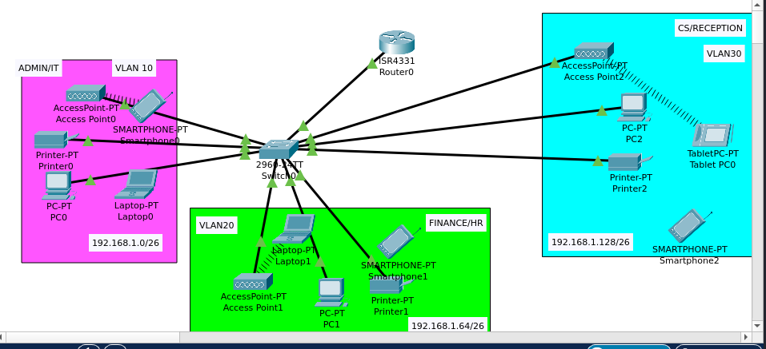

# Network Design and Implementation for XYZ Company Branch




## Project Overview

This repository contains the design and implementation of a small-scale network for a new branch of XYZ Company located in Bonalbo, Eastern Australia. The project addresses specific requirements for departmental segmentation, wireless access, automatic IP addressing, and inter-departmental communication, operating independently from the company's headquarters network.

## Objective

The primary objective is to design and implement a robust and functional network for the new XYZ Company branch, considering the following core requirements:

* Utilize one Cisco router and one Cisco switch.
* Support three distinct departments: Admin/IT, Finance/HR, and Customer Service/Reception.
* Isolate each department into separate VLANs.
* Provide dedicated wireless network access for users in each department.
* Ensure all host devices automatically obtain IPv4 addresses (DHCP).
* Enable seamless communication between devices across all departments.

## Network Requirements

Based on the company's needs, the network design adheres to these specific points:

* **Networking Hardware:** One Cisco Router and one Cisco Switch.
* **Departments:** Admin/IT, Finance/HR, Customer Service/Reception.
* **VLAN Segmentation:** Each department must reside in a unique VLAN.
* **Wireless Connectivity:** Each department requires its own wireless network.
* **IP Address Assignment:** Automatic IPv4 address assignment (DHCP) for all host devices.
* **Inter-VLAN Communication:** Full connectivity between devices in different departments (VLANs).
* **Base Network:** ISP provided base network of `192.168.1.0/24`.

## Network Design - Subnetting

The base network `192.168.1.0/24` was subnetted to accommodate the three required departments, ensuring efficient IP address allocation and network segmentation.

* **Base Network:** `192.168.1.0`
* **Required Subnets:** 3
* **Borrowed Bits:** 2 bits (since $2^2 = 4$ subnets, which is sufficient)
* **New Subnet Mask:** `255.255.255.192` (or `/26`)
* **Block Size:** 64

### Subnet Details:

| Department/VLAN | Network ID     | Host Range                     | Broadcast ID     | Default Gateway (Example) |
| :-------------- | :------------- | :----------------------------- | :--------------- | :------------------------ |
| **Admin/IT** | `192.168.1.0/26` | `192.168.1.1` - `192.168.1.62` | `192.168.1.63`   | `192.168.1.1`             |
| **Finance/HR** | `192.168.1.64/26`| `192.168.1.65` - `192.168.1.126`| `192.168.1.127`  | `192.168.1.65`            |
| **Cust. Service**| `192.168.1.128/26`|`192.168.1.129` - `192.168.1.190`| `192.168.1.191`  | `192.168.1.129`           |

## Implementation Steps (High-Level)

The implementation in Cisco Packet Tracer involved the following key configurations:

1.  **Device Placement & Cabling:** Setting up the router, switch, access points, and end devices, followed by correct cabling.
2.  **VLAN Configuration on Switch:**
    * Creating VLANs (e.g., VLAN 10, 20, 30) for each department.
    * Assigning switch ports to the appropriate VLANs (`access` mode).
    * Configuring the router-facing port as a `trunk` to allow all VLAN traffic.
3.  **Router Configuration (Inter-VLAN Routing & DHCP):**
    * Creating sub-interfaces for each VLAN on the router's interface connected to the switch.
    * Assigning IP addresses (acting as default gateways) to each sub-interface.
    * Configuring DHCP pools for each VLAN to automatically assign IP addresses to devices.
4.  **Wireless Access Point Configuration:**
    * Setting unique SSIDs for each department's wireless network.
    * Configuring WPA2-PSK security with strong passwords.
5.  **End Device Configuration:**
    * Setting all PCs, laptops, printers, and mobile devices to obtain IP addresses via DHCP.
    * Connecting wireless devices to their respective SSIDs using the correct passwords.
6.  **Verification:** Pinging devices across different VLANs to confirm inter-VLAN routing and overall connectivity.

## Technologies Used

* **Cisco Packet Tracer:** Network simulation software.
* **Cisco IOS:** Operating system for Cisco networking devices.
* **IPv4 Subnetting:** For IP address planning.
* **VLANs (Virtual Local Area Networks):** For network segmentation.
* **Inter-VLAN Routing:** For communication between segmented networks.
* **DHCP (Dynamic Host Configuration Protocol):** For automatic IP address assignment.
* **Wireless LAN (WLAN):** For wireless connectivity.
* **WPA2-PSK:** Wireless security protocol.

## How to Use This Repository

1.  **Clone the repository:**
    ```bash
    git clone https://github.com/mrblue223/Networking_projects.git
    cd Networking_projects
    ```
2.  **Open the Packet Tracer file:** Navigate to the cloned directory and open the `.pkt` file using Cisco Packet Tracer.
3.  **Explore the configuration:** You can inspect the configurations of the router, switch, and access points, and test the network connectivity.

